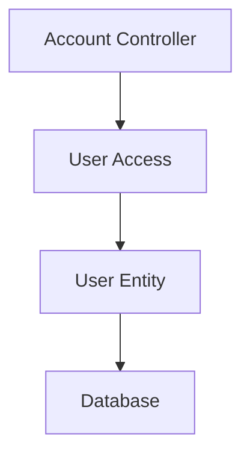

# API Call Chains

This document describes the flow of data through the API endpoints.

## Account Management

### User Authentication and Management



#### Flow Description:

1. **Account Controller** (`src/manager/account.controller.ts`)

   - Handles HTTP requests for user operations
   - Manages user authentication and profile operations
   - Validates incoming requests

2. **User Access** (`src/access/services/user-access.service.ts`)

   - Implements business logic for user operations
   - Handles database operations through TypeORM
   - Manages user data persistence

3. **User Entity** (`src/access/entities/user.entity.ts`)

   - Defines the user data structure
   - Contains user-related validation rules
   - Maps to database table

4. **Database**
   - Stores user information
   - Handles data persistence
   - Ensures data integrity

### Key Operations

1. **User Registration**

   - Account Controller receives registration request
   - User Access service validates and creates new user
   - User data is stored in database

2. **User Authentication**

   - Account Controller receives login request
   - User Access service verifies credentials
   - Returns authentication token on success

3. **Profile Management**
   - Account Controller handles profile updates
   - User Access service manages profile data
   - Updates are persisted to database

## Rules for Call Chain Creation

### Layer Structure

- Access Layer (src/access/):

  - Services (src/access/services/): Contains all database access logic
  - Entities (src/access/entities/): Contains all database entities
  - DTOs (src/access/services/[entity]-access.ts): Contains DTOs for the service

- Manager Layer (src/manager/):
  - Controllers (src/manager/[entity].controller.ts): Handles API endpoints
  - Module (src/manager/manager.module.ts): Registers all controllers

### File Naming Conventions

- Entities: src/access/entities/[entity].entity.ts
- Access Services: src/access/services/[entity]-access.service.ts
- Controllers: src/manager/[entity].controller.ts

### Call Chain Flow

1. API Endpoint (Controller)
2. Controller Method
3. Access Service Method
4. Repository Operation
5. Database Action

Example:

```
GET /api/client
-> ClientController.findAll
-> ClientAccess.findAll
-> ClientRepository.findAndCount
```

### Required Files for New Entity

1. Entity: src/access/entities/[entity].entity.ts
2. Access Service: src/access/services/[entity]-access.service.ts
   - Contains DTOs
   - Contains database operations
3. Controller: src/manager/[entity].controller.ts
4. Update manager.module.ts to include controller

### Standard Operations

Each entity should support:

- findAll (GET /api/[entity])
- findOne (GET /api/[entity]/:id)
- create (POST /api/[entity])
- update (PUT /api/[entity]/:id)
- delete (DELETE /api/[entity]/:id)

### Relationships

- Related operations should be included in the parent controller
- Example: GET /api/client/:id/projects

## Tenant Operations

### Get All Tenants

```
GET /api/tenant
-> TenantController.findAll
-> TenantAccess.findAll
-> TenantRepository.findAndCount
```

### Get Single Tenant

```
GET /api/tenant/:id
-> TenantController.findOne
-> TenantAccess.find
-> TenantRepository.findOne
```

### Create Tenant

```
POST /api/tenant
-> TenantController.create
-> TenantAccess.upsert
-> TenantRepository.create
-> TenantRepository.save
```

### Update Tenant

```
PUT /api/tenant/:id
-> TenantController.update
-> TenantAccess.find
-> TenantAccess.upsert
-> TenantRepository.update
```

## Account Operations

### User Authentication (Login)

```
POST /api/account/login
-> AccountController.login
-> UserAccess.verifyAuth
-> UserRepository.findOne
-> bcrypt.compare
-> JwtService.sign
-> Returns { accessToken, user }
```

### User Registration (Signup)

```
POST /api/account/signup
-> AccountController.signup
-> UserAccess.upsert
-> bcrypt.hash
-> UserRepository.create/save
-> UserAccess.verifyAuth
-> Returns { accessToken, user }
```

### Get All Accounts

```
GET /api/account
Headers: X-Tenant-ID (optional)
-> AccountController.findAll
-> UserAccess.findAll
-> UserRepository.findAndCount
-> Returns { items, total, take, skip }
```

### Get Single Account

```
GET /api/account/:id
-> AccountController.findOne
-> UserAccess.find
-> UserRepository.findOne
```

### Create Account

```
POST /api/account
-> AccountController.create
-> UserAccess.upsert
-> bcrypt.hash
-> UserRepository.create
-> UserRepository.save
```

### Update Account

```
PUT /api/account/:id
-> AccountController.update
-> UserAccess.upsert
-> UserAccess.find
-> bcrypt.hash (if password provided)
-> UserRepository.save
```

### Add User to Tenant

```
POST /api/account/tenant/add-user
Headers: X-Tenant-ID (optional)
-> AccountController.addUserToTenant
-> UserAccess.find
-> TenantAccess.find
-> UserAccess.addToTenant
-> UserRepository.save
```

### Change Password

```
POST /api/account/changepassword
-> AccountController.changePassword
-> UserAccess.changePassword
-> UserAccess.find
-> bcrypt.compare (verify old password)
-> bcrypt.hash (hash new password)
-> UserRepository.save
```

Request body:

```json
{
  "currentPassword": "string",
  "newPassword": "string"
}
```

Response:

- 200: Password changed successfully
- 401: Current password is incorrect
- 404: User not found

### Data Flow Notes

#### Password Handling

- Passwords are never stored in plain text
- bcrypt is used for password hashing
- Password hash is removed from all responses

#### Tenant Filtering

- Can filter users by tenant using query param or X-Tenant-ID header
- Tenant relationship is loaded for user queries
- Returns only users belonging to specified tenant

#### Authentication Response

Returns:

- accessToken: JWT token
- user: {
  - id
  - username
  - first_name
  - last_name
  - email
  - phone
  - role
  - tenants: Array of { id, name }
    }

## Data Flow Notes

### Password Handling

- Passwords are never stored in plain text
- bcrypt is used for password hashing
- Password hash is removed from all responses

### Pagination

Both Tenant and Account list operations support pagination with:

- page: Page number (1-based)
- limit: Items per page
- Returns total count and total pages

### Error Handling

- 404: Resource not found
- 401: Invalid credentials (login)
- Validation errors for invalid input

## Project Operations

### Get All Projects

```
GET /api/project
-> ProjectController.findAll
-> ProjectAccess.findAll
-> ProjectRepository.findAndCount
```

### Get Single Project

```
GET /api/project/:id
-> ProjectController.findOne
-> ProjectAccess.find
-> ProjectRepository.findOne
```

### Create Project

```
POST /api/project
-> ProjectController.create
-> ProjectAccess.upsert
-> ProjectRepository.create
-> ProjectRepository.save
```

### Update Project

```
PUT /api/project/:id
-> ProjectController.update
-> ProjectAccess.find
-> ProjectAccess.upsert
-> ProjectRepository.update
```

## Project Environment Operations

### Get Project Environments

```
GET /api/project/:projectId/environment
-> ProjectController.findEnvironments
-> ProjectAccess.findEnvironments
-> EnvironmentRepository.find
```

### Create Environment

```POST /api/project/:projectId/environment
-> ProjectController.createEnvironment
-> ProjectAccess.find (verify project exists)
-> ProjectAccess.generateEnvironmentCredentials
-> ProjectAccess.createEnvironment
-> EnvironmentRepository.save
```

### Update Environment

```
PUT /api/project/:projectId/environment/:envId
-> ProjectController.updateEnvironment
-> ProjectAccess.findEnvironment
-> ProjectAccess.updateEnvironment
-> EnvironmentRepository.update
```

### Delete Environment

```
DELETE /api/project/:projectId/environment/:envId
-> ProjectController.deleteEnvironment
-> ProjectAccess.findEnvironment
-> ProjectAccess.deleteEnvironment
-> EnvironmentRepository.delete
```

## System Settings Operations

### Get All Settings

```
GET /api/system-settings
-> SystemSettingsController.findAll
-> SystemSettingsAccess.findAll
-> SystemSettingsRepository.findAndCount
```

### Get Single Setting

```
GET /api/system-settings/:id
-> SystemSettingsController.findOne
-> SystemSettingsAccess.find
-> SystemSettingsRepository.findOne
```

### Create/Update Setting

```
PUT /api/system-settings/:id
-> SystemSettingsController.upsert
-> SystemSettingsAccess.upsert
-> SystemSettingsRepository.update/save
```

### Delete Setting

```
DELETE /api/system-settings/:id
-> SystemSettingsController.delete
-> SystemSettingsAccess.delete
-> SystemSettingsRepository.delete
```

### Get Setting Value

```
-> SystemSettingsAccess.getValue
-> SystemSettingsAccess.find
-> SystemSettingsRepository.findOne
```

Note: All protected endpoints require:

- Authorization header: `Bearer <token>`
- Valid JWT token from login
- Token expiration: 24 hours

## Client Operations

Clients belong to tenants. Each tenant can have multiple clients, and clients can have multiple projects.

### Get All Clients

```
GET /api/client
-> ClientController.findAll
-> ClientAccess.findAll
-> ClientRepository.findAndCount
```

### Get Tenant Clients

```
GET /api/tenant/:tenantId/client
-> ClientController.findByTenant
-> ClientAccess.findByTenant
-> ClientRepository.findByTenantId
```

### Get Single Client

```
GET /api/client/:id
-> ClientController.findOne
-> ClientAccess.find
-> ClientRepository.findOne
```

### Create Client

```
POST /api/client
-> ClientController.create
-> ClientAccess.upsert
-> ClientRepository.create
-> ClientRepository.save
```

### Update Client

```
PUT /api/client/:id
-> ClientController.update
-> ClientAccess.find
-> ClientAccess.upsert
-> ClientRepository.update
```

### Delete Client

```
DELETE /api/client/:id
-> ClientController.delete
-> ClientAccess.find
-> ProjectAccess.findByClient (check for existing projects)
-> ClientAccess.delete
-> ClientRepository.delete
```

### Get Client Projects

```
GET /api/client/:clientId/project
-> ClientController.findProjects
-> ClientAccess.find
-> ProjectAccess.findByClient
-> ProjectRepository.findByClientId
```
