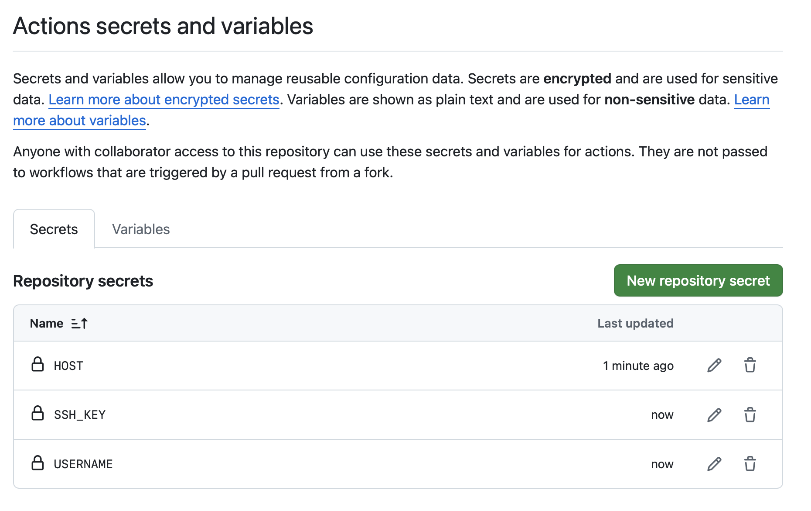

# Backend Deployment Notes

# SSH Deployment

Deployment is through a github action that will ssh into the VM and upload the frontend and backend.

You will need to set up the following secrets in your github repository:

