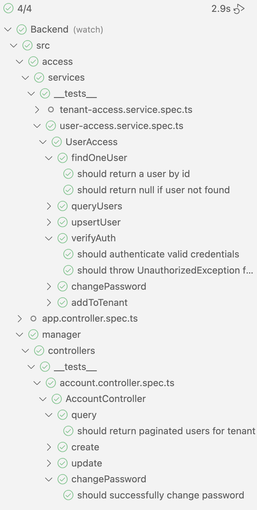

# Panic Blaster - Backend Template

<p align="center">
  
</p>

## Description

Backend API is a NestJS application that provides a REST API for the Panic Blaster project.

You can get to the documentation at http://localhost:3001/api-docs. When building calls, you can use the Swagger UI to test the API. Build backend to run against the API.

## Table of Contents

1. [API Call Chains](CALLCHAINS.md)
2. [Project Setup](#project-setup)
3. [Compile and Run](#compile-and-run-the-project)
4. [Run Tests](#run-tests)
5. [Deployment](#deployment)
   - [Production Deployment](#production-deployment)
   - [Cloud Deployment](#cloud-deployment)
6. [API Documentation](#api-documentation)
   - [Swagger UI Features](#swagger-ui-features)
7. [Project Structure](#project-structure)
   - [Architecture Overview](#architecture-overview)
   - [Key Features](#key-features)

## Project setup

```bash
$ npm install
```

## Compile and run the project

```bash
# development
$ npm run start

# watch mode
$ npm run start:dev

# production mode
$ npm run start:prod
```

## Run tests

```bash
# unit tests
$ npm run test

# e2e tests
$ npm run test:e2e

# test coverage
$ npm run test:cov
```

Running test within VS Code, or VS Code derivatives like Cursor can be done using the Jest extension.


Running tests using the Jest extension is recommended.



## What if process hang in development?

Mac/Linux

```bash
sudo kill $(lsof -t -i:3001)
```

Windows

```
netstat -ano | findstr :3001
taskkill /PID <PID> /F
```

## VS Code

launch.json

```
{
  "version": "0.2.0",
  "configurations": [
    {
      "type": "node",
      "request": "launch",
      "name": "Debug NestJS",
      "runtimeExecutable": "npm",
      "runtimeArgs": ["run", "start:debug"],
      "console": "integratedTerminal",
      "restart": true,
      "autoAttachChildProcesses": true,
      "sourceMaps": true,
      "envFile": "${workspaceFolder}/.env"
    }
  ]
}
```

tasks.json

```
{
  "version": "2.0.0",
  "tasks": [
    {
      "type": "npm",
      "script": "start:dev",
      "problemMatcher": [],
      "label": "npm: start:dev",
      "detail": "Start NestJS in development mode",
      "group": {
        "kind": "build",
        "isDefault": true
      }
    },
    {
      "type": "npm",
      "script": "build",
      "group": "build",
      "problemMatcher": [],
      "label": "npm: build",
      "detail": "Build NestJS application"
    }
  ]
}
```

## API Documentation

This project includes Swagger/OpenAPI documentation for all endpoints. To access the interactive API documentation:

1. Start the application:

```bash
npm run start:dev
```

2. Open your browser and navigate to:

```
http://localhost:3001/api-docs
```

### Swagger UI Features

- Interactive API documentation
- Request/response examples
- Try-it-out functionality
- Schema definitions
- OpenAPI specification

## Project Structure

```
src/
├── access/                           # Data access layer
│   ├── entities/                     # Database entities
│   │   ├── tenant.entity.ts
│   │   ├── user.entity.ts
│   └── services/                     # Data access services
│       ├── tenant-access.service.ts
│       ├── user-access.service.ts
├── manager/                          # API Controllers
│   ├── account.controller.ts
│   ├── auth.controller.ts
├── common/                           # Shared code
│   └── dto/                          # Data Transfer
│   └── pagination.dto.ts
│   └── query.dto.ts
│   └── auth.dto.ts
│   └── tenant.dto.ts
│   └── user.dto.ts
└── config/                           # Configuration
    └── database.config.ts
```

### Architecture Overview

The project follows a layered architecture:

1. **Access Layer** (`src/access/`)

   - Handles data persistence and business logic
   - Contains database entities and their relationships
   - Provides services for CRUD operations
   - Implements business rules and validations
   - All access services must be added to the access module.

2. **Manager Layer** (`src/manager/`)

   - Implemented as controller. AccountManager is created as AccountController in src/manager/account.controller.ts
   - Handles HTTP requests and responses
   - Implements REST API endpoints
   - Provides Swagger documentation
   - Handles input validation and error responses
   - All managers/controllers must be added to the managers module.

3. **Common Layer** (`src/common/`)

   - Contains shared code and utilities
   - Defines common DTOs and interfaces
   - Implements cross-cutting concerns

4. **Config Layer** (`src/config/`)
   - Database configuration
   - All entities must be added to the config module.

### Key Features

- **Authentication**: User authentication with secure password handling
- **Multi-tenancy**: Support for multiple tenants with isolated projects
- **Project Management**: Full project lifecycle with environment management
- **System Settings**: Global configuration management
- **API Documentation**: Swagger/OpenAPI documentation
- **Type Safety**: TypeScript with strict type checking
- **Input Validation**: Request validation using class-validator
- **Pagination**: Built-in support for paginated responses

For detailed API call chains and data flows, see [CALLCHAINS.md](CALLCHAINS.md).

# Controller/Manager HTTP Call Guidelines

Tenant Id can be passed in the header or in the body. If it is passed in the body, it must match the tenant id in the header. Query options should be passed thru query (QueryOptionsDto) object.

Examples below assume we are building a multi-tenant application. Tenant related information could be removed if we are building a single-tenant application.

## Manager Module

All managers/controllers must be added to the managers module. New managers/controllers should be added to the manager.module.ts file.

```typescript
@Module({
  imports: [
    AccessModule,
    JwtModule.register({
      secret: process.env.JWT_SECRET || 'your-secret-key',
      signOptions: { expiresIn: '30d' },
    }),
    HttpModule,
  ],
  controllers: [AccountController, AuthController, TenantController, NewManagerController],
})
```

## Auth guard

Managers should use the JwtAuthGuard to validate the JWT token.

```
import { JwtAuthGuard } from 'src/auth/jwt.guard';
```

## REST API Call Guidelines

If we are implementing a REST Style API use standard REST guidelines.

- Retrieve a single item: GET /api/v1/items/:id
- Retrieve a list of items: GET /api/v1/items
- Create an item: POST /api/v1/items
- Update an item: PUT /api/v1/items/:id

## List/FindAll/Query

If we are in a findAll type call, we should see if the tenantId is passed in the header and if it is, we should add it to the query.

Query includes pagination, sorting, and filtering.

Query example:

```typescript
  @Get()
  @ApiOperation({ summary: 'Get all clients' })
  async queryClients(
    @Query(ValidationPipe) query: QueryOptionsDto,
    @Headers('X-Tenant-ID') tenantId?: string
  ) {
    this.validateTenantId(tenantId);

    if (tenantId) {
      query.where = {
        ...(query.where || {}),
        tenantId,
      };
    }

    return this.clientAccess.queryClients({
      ...query,
      where: {
        ...(query.where || {}),
        ...(tenantId && { tenantId }),
      },
    });
  }
```

## FindOne

If we are implementing a findOne type call, we should see if the tenantId is passed in the header and if it is, we should add it to the query. In general name these for the item type we are looking up. So a find one for a client would be findOneClient.

FindOne example:

```typescript
  @Get(':id')
  @ApiOperation({ summary: 'Get a client by id' })
  async findOneClient(
    @Headers('X-Tenant-ID') tenantId: string,
    @Param('id') id: string
  ) {
    this.validateTenantId(tenantId);

    const client = await this.clientAccess.findOneClient({id});
    if (client.tenantId !== tenantId) {
      throw new NotFoundException('Client not found');
    }
    return client.item;
  }
```

## Create

If we are implementing a create type call, we should see if the tenantId is passed in the header and if it is, we should add it to the body.

Create should return the id of the created item.

Create example:

```typescript
  @Post()
  @ApiOperation({ summary: 'Create a new client' })
  async create(
    @Headers('X-Tenant-ID') tenantId: string,
    @Body(ValidationPipe) data: CreateClientDto
  ) {
    this.validateTenantId(tenantId, data.tenantId);
    if (!data.tenantId) {
      data.tenantId = tenantId;
    }
    if (tenantId) {
      if (tenantId !== data.tenantId) {
        throw new BadRequestException(
          'Tenant ID in header must match tenant ID in body'
        );
      }
  }
  const id = await this.clientAccess.upsertClient(data);
  return {
    id,
    message: 'Client created successfully',
    status: 'success',
  };
}
```

If we are implementing an update type call, we should see if the tenantId is passed in the header and if it is, we should add it to the body.

## Update

Update should return the id of the updated item.

Update example:

```typescript
  @Put(':id')
  @ApiOperation({ summary: 'Update a client' })
  async update(
    @Headers('X-Tenant-ID') tenantId: string,
    @Param('id') id: string,
    @Body(ValidationPipe) data: UpdateClientDto
  ) {
    this.validateTenantId(tenantId, data.tenantId);

    if (!data.tenantId) {
      data.tenantId = tenantId;
    }
    if (tenantId) {
      if (tenantId !== data.tenantId) {
        throw new BadRequestException(
          'Tenant ID in header must match tenant ID in body'
        );
      }
    }

    const client = await this.clientAccess.findOneClient(id);
    if (client.tenantId !== tenantId) {
      throw new NotFoundException('Client not found');
    }

    const id = await this.clientAccess.upsertClient(data, id);
    return {
      id,
      message: 'Client updated successfully',
      status: 'success',
    };
  }
```

# Data Access

Typical data access will should use similar methods, with similar naming. All data access should be in the access layer. The entity objects should NEVER be exposed, we should always return a DTO (common/dto) object.

## Upsert Example

Upsert should return the id of the created or updated item.

```typescript
  @Put(':id')
  @ApiOperation({ summary: 'Update a client' })
  async update(
    @Headers('X-Tenant-ID') tenantId: string,
    @Param('id') id: string,
    @Body(ValidationPipe) data: UpdateClientDto
  ) {
    this.validateTenantId(tenantId, data.tenantId);

    if (!data.tenantId) {
      data.tenantId = tenantId;
    }
    if (tenantId) {
      if (tenantId !== data.tenantId) {
        throw new BadRequestException(
          'Tenant ID in header must match tenant ID in body'
        );
      }
    }

    const client = await this.clientAccess.findOneClient(id);
    if (client.tenantId !== tenantId) {
      throw new NotFoundException('Client not found');
    }

    await this.clientAccess.upsertClient(data, id);
    return {
      id,
      success: true,
      message: 'Client updated successfully',
    };
  }
```

# Data Access

Typical data access will should use similar methods, with similar naming. All data access should be in the access layer. The entity objects should NEVER be exposed, we should always return a DTO (common/dto) object.

## Upsert Example

Upsert should return the id of the created or updated item.

```typescript
  async upsertCatalog(data: CatalogDto, id?: string): Promise<string> {

    const existingCatalog = await this.catalogRepository.findOne({
      where: { id },
    });
    if (existingCatalog) {
      // Update existing catalog
      existingCatalog.name = data.name;
      existingCatalog.description = data.description;
      existingCatalog.notes = data.notes;
      existingCatalog.isEnabled = data.isEnabled ?? existingCatalog.isEnabled;
      existingCatalog.isDeleted = data.isDeleted ?? existingCatalog.isDeleted;
      existingCatalog.contractorId = data.contractorId;

      await this.catalogRepository.save(existingCatalog);
      return existingCatalog.id;
    } else {
      // Create new item
      if (!id) {
        id = uuidv4();
      }

      const catalog = this.catalogRepository.create({
        ...data,
        id: id,
      });
      const savedCatalog = await this.catalogRepository.save(catalog);
      return savedCatalog.id;
    }
  }
```

## Find One Example

```typescript
  async findOneUser(
    options: QueryOptionsDto
  ): Promise<QueryResultItem<User> | null> {
    const user = await this.userRepository.findOne({
      where: { id: options.id },
      relations: ['tenants'],
    });

    if (!user) return null;

    return {
      item: user,
      id: user.id,
    };
  }
```

## Query Example

```typescript
  async queryUsers(options: QueryOptionsDto): Promise<QueryResult<User>> {
    const [items, total] = await this.userRepository.findAndCount({
      take: options.take || 10,
      skip: options.skip || 0,
      where: options.where || {},
      order: options.order || { createdAt: 'DESC' },
      relations: ['tenants'],
    });

    return {
      items: items.map((item) => ({
        item,
        id: item.id,
      })),
      total,
      take: options.take || 10,
      skip: options.skip || 0,
    };
  }
```

# DTOs

DTOs are located in src/common/dto. They are used to transfer data between the controller and the access layer. They are also used to validate data passed in the body of a request.

## Ids

Ids should be strings, which are UUIDs.

DTO objects should not include the Id. Ids should be separate from the DTO. For example a client DTO should look like the following. All upsert calls should include an id parameter, and all upsert calls should return the id of the created or updated item.

```typescript
export class ClientDto {
  @ApiProperty({ description: 'The name of the client' })
  name: string;
}
```

The Id should be passed in as a parameter to the upsert method.

```typescript
async upsertClient(data: clientDto, id?: string) {
```

If we are returning a single item, we should return the DTO object. Example below would be returning a ClientDTO.

```typescript
return this.clientAccess.findOneClient(id);
```

If we are returning a list of items, we should return a list of DTO objects. Example below would be returning a list of ClientDTOs.

```typescript
return this.clientAccess.queryClients(queryOptions);
```

When returning a list of items we should wrap the DTO object in a QueryResult object.

```typescript
return {
  items: items.map((item) => ({
    item: item,
    id: item.id,
  })),
  total: items.length,
  take: queryOptions.take,
  skip: queryOptions.skip,
};
```

QueryResult is defined in src/common/dto/query.dto.ts.

```typescript
export interface QueryResultItem<T> {
  item: T;
  id: string;
}

export interface QueryResult<T> {
  items: QueryResultItem<T>[];
  total: number;
  take: number;
  skip: number;
}
```

# AI Code Generation Guidelines

When generating an new Access Service, use the following guidelines.

1. Create the entity in the access/entities folder.
2. Create the service in the access/services folder.
3. Create the DTO in the common/dto folder.
4. Update access.module.ts to include the entity and service.
5. Update database.config.ts to include the entity.
6. Create the tests for the service in the access/services/ folder.
7. Tests should live right next to the service file.

When generating an entity, use the following guidelines.

1. Create the entity in the access/entities folder.
2. Update database.config.ts to include the entity.
3. Create the DTO in the common/dto folder.
4. Update access.module.ts to include the entity

When generating an new Manager, use the following guidelines.

1. Create the controller in the manager folder.
2. Update manager.module.ts to include the new controller.
3. Create the tests for the controller in the manager folder.
4. Tests should live right next to the controller file.

Other notes:

- If a call chain is modified or created, update the CALLCHAINS.md file.

## AI Code Generation and Testing

AI Code generation should generate tests when creating manager or access code. Look at the existing tests for examples of how to test the code.

AI should focus on generating good smoke tests, but should not be relied on for comprehensive tests.

## AI Code Generation example

```
Obey rules as defined in the README.md file. Make sure to obey all rules in the AI Code Generation Guidelines section.

WorkManager (WorkController) --> TaskAccess-->TaskEntity

Task Entity should have the following properties
id
title
description
isComplete (boolean)
startDate
endDate
duration (number)

make sure code will compile when completed.
```

The above would create the following files:

```
- src/access/entities/task.entity.ts
- src/access/services/task-access.service.ts
- src/access/services/task-access.service.spec.ts
- src/common/dto/task.dto.ts
- src/manager/controllers/work.controller.ts
- src/manager/controllers/work.controller.spec.ts
- src/manager/manager.module.ts
```

The above would modify the following files:

```
- src/manager/manager.module.ts
- src/access/access.module.ts
- CALLCHAINS.md
```

---

<p align="center">
  Powered by <a href="#">Panic Blaster</a> 🚀
</p>
