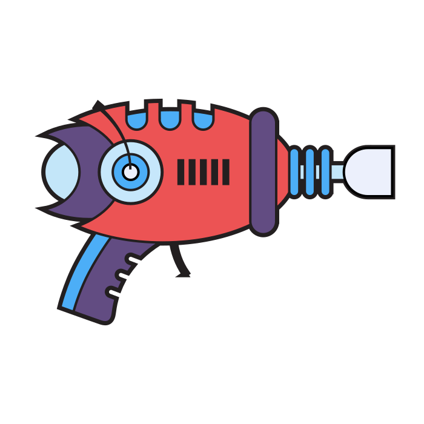

# Panic Blaster - Frontend Template

# DPL API

<p align="center">
  
</p>

## Backend API

Backend API

## Development server

To start a local development server, run:

```bash
ng serve
```

The application will run on port 4201 by default. Once the server is running, open your browser and navigate to `http://localhost:4201/`. The application will automatically reload whenever you modify any of the source files.

## Code scaffolding

Angular CLI includes powerful code scaffolding tools. To generate a new component, run:

```bash
ng generate component component-name
```

For a complete list of available schematics (such as `components`, `directives`, or `pipes`), run:

```bash
ng generate --help
```

## Building

To build the project run:

```bash
ng build
```

This will compile your project and store the build artifacts in the `dist/` directory. By default, the production build optimizes your application for performance and speed.

## Running unit tests

To execute unit tests with the [Karma](https://karma-runner.github.io) test runner, use the following command:

```bash
ng test
```

## Running in VS Code or Cursor

Tasks (tasks.json - in .vscode folder)

```json
{
  // For more information, visit: https://go.microsoft.com/fwlink/?LinkId=733558
  "version": "2.0.0",
  "tasks": [
    {
      "type": "npm",
      "script": "start",
      "isBackground": true,
      "problemMatcher": {
        "owner": "typescript",
        "pattern": "$tsc",
        "background": {
          "activeOnStart": true,
          "beginsPattern": {
            "regexp": "(.*?)"
          },
          "endsPattern": {
            "regexp": "bundle generation complete"
          }
        }
      }
    },
    {
      "type": "npm",
      "script": "test",
      "isBackground": true,
      "problemMatcher": {
        "owner": "typescript",
        "pattern": "$tsc",
        "background": {
          "activeOnStart": true,
          "beginsPattern": {
            "regexp": "(.*?)"
          },
          "endsPattern": {
            "regexp": "bundle generation complete"
          }
        }
      }
    }
  ]
}
```

Launch Config (launch.json)

```json
{
  // For more information, visit: https://go.microsoft.com/fwlink/?linkid=830387
  "version": "0.2.0",
  "configurations": [
    {
      "name": "ng serve",
      "type": "chrome",
      "request": "launch",
      "preLaunchTask": "npm: start",
      "url": "http://localhost:4201/"
    },
    {
      "name": "ng test",
      "type": "chrome",
      "request": "launch",
      "preLaunchTask": "npm: test",
      "url": "http://localhost:9876/debug.html"
    }
  ]
}
```

Extensions

```json
{
  // For more information, visit: https://go.microsoft.com/fwlink/?linkid=827846
  "recommendations": ["angular.ng-template"]
}
```

# Page paradigm

Most pages are based on the following paradigm:

- List (list.component.ts)
- Detail/Edit (detail.component.ts)

## List Pages

The list page is a table that displays a list of items. It uses the `TableModule` from PrimeNG. This table should do pagination using skip and take.

## Detail/Edit Pages

The detail page is a form that displays a single item. It uses the `FormModule` from PrimeNG. This form should be used for details, create and edit.

Details route would be something like `/tenants/123` and the edit route would be `/tenants/123/edit`. The new route would be `/tenants/new`.

The detail page should have a back button that goes to the list page.

All pages should have a toolbar.

This toolbar should have a back button to go to the list page. The back button should be on the left side of the toolbar.

The toolbar will usually have an edit button that will engage edit mode. When going into edit mode the form should be populated with the item data and the edit button should change to a save button. When in edit mode the save button should be on the right side of the toolbar.

When in edit mode the route should include a /edit at the end.
Example: `/tenants/123/edit`

When creating a new item the route should include a /new at the end.
Example: `/tenants/new`

When the form sees a /new it should not query the backend for data.

For most detail pages their should also be a delete button to the left of the save button. You can delete the item by clicking the delete button. The delete button should be disabled if the item is new. The delete button should be enabled if the item is not new. The delete button should display a confirmation dialog before deleting the item.

Do not use the DropDown Component from PrimeNG use the select component from PrimeNG.

Form fields should be full width.

## Toolbar responsiveness

The toolbar should be responsive. It should have a back button on the left side and a save button on the right side. If we are on a mobile device do not display the text, just icons.

## Application Structure

The application consists of three main components:

- `app.component.ts/html`: The root component of the application
- `auth.component.ts/html`: Handles authentication functionality
- `home.component.ts/html`: The main landing page component

## Common imported components

The application uses the following common imports:

```
  imports: [
    CommonModule,
    RouterModule,
    ButtonModule,
    ToastModule,
    TooltipModule,
    ToolbarModule,
  ],
```

# AI Generation

As a goal we should always be reusing base components. Each page should just be a configuration of base components.

Base components

- ItemList (Table) src/app/components/item-list/item-list-component.ts
- ItemDetail (Form) src/app/components/item/detail/item-detail-component.ts

List pages should be generated like the user list page. List pages should use the item-list component. Look at the user list page for an example.

```typescript
@Component({
  selector: 'app-user-list',
  standalone: true,
  imports: [ItemListComponent],
  template: `<app-item-list [config]="listConfig"></app-item-list>`,
})
export class UserListComponent {
  listConfig: ItemListConfig = {
    header: 'Users',
    supportsAdd: true,
    supportsEdit: true,
    supportsDelete: true,
    defaultSortField: 'username',
    columns: [
      {
        field: 'username',
        header: 'Username',
        type: 'text',
        sortable: true,
      },
      { field: 'email', header: 'Email', type: 'text', sortable: true },

      {
        field: 'createdAt',
        header: 'Created',
        type: 'date',
        format: 'short',
        sortable: true,
      },
    ],
    dataService: {
      parseParams: (params, queryParams) => ({
        skip: queryParams['skip'] || 0,
        take: queryParams['take'] || 10,
        where: { tenantId: this.authService.getCurrentTenant()?.id },
      }),
      loadItems: (params) => this.accountService.getAccounts(params),
      deleteItem: (params, item) => this.accountService.deleteAccount(item.id),
    },
  };

  constructor(
    private accountService: AccountService,
    private authService: AuthService
  ) {}
}
```

Detail pages should be generated like the user detail page. Detail pages should use the item-detail component. Look at the user detail page for an example.

```tyepscript
@Component({
  selector: 'app-user-detail',
  standalone: true,
  imports: [CommonModule, ItemDetailComponent, ToastModule],
  providers: [MessageService],
  template: `<app-item-detail [config]="detailConfig"></app-item-detail>`,
})
export class UserDetailComponent {
  detailConfig: ItemDetailConfig = {
    header: 'User Details',
    isEditable: true,
    supportsAdd: false,
    supportsDelete: true,
    updateSuccessMessage: 'User updated successfully',
    breadcrumbField: 'username',
    formLayout: [
      { key: 'username', label: 'Username', type: 'text', required: true },
      {
        key: 'password',
        label: 'Password',
        type: 'password',
        required: true,
        newOnly: true,
      },
      { key: 'email', label: 'Email', type: 'text', required: true },
      { key: 'firstName', label: 'First Name', type: 'text', required: true },
      { key: 'lastName', label: 'Last Name', type: 'text', required: true },
      {
        key: 'role',
        label: 'Role',
        type: 'select',
        required: true,
        options: [
          { label: 'Admin', value: 'admin' },
          { label: 'User', value: 'user' },
        ],
      },
    ],
    customToolbarItems: [
      {
        label: 'Reset Password',
        icon: 'pi pi-lock',
        onClick: () => this.resetPassword(),
      },
      {
        label: 'Tenants',
        icon: 'pi pi-sitemap',
        onClick: () => this.showTenants(),
      },
    ],
    dataService: {
      parseParams: (params, queryParams) => ({
        id: params['id'],
        where: { tenantId: this.authService.getCurrentTenant()?.id },
        isNew: params['id'] === 'new',
      }),
      loadItem: (params) => this.accountService.getAccount(params.id || ''),
      createItem: (params, item) => this.accountService.createAccount(item),
      updateItem: (params, item) =>
        this.accountService.updateAccount(params.id || '', item),
      deleteItem: (params) =>
        this.accountService.deleteAccount(params.id || ''),
    },
  };

  constructor(
    private accountService: AccountService,
    private authService: AuthService,
    private route: ActivatedRoute,
    private router: Router
  ) {
    console.log('User detail Constructor');
  }

  ngOnInit() {
    console.log('User detail ngOnInit');

    this.route.snapshot.data['label'] = 'goodbye';
  }

  resetPassword() {
    console.log('Reset password');
  }

  showTenants() {
    console.log('Show tenants');
    this.router.navigate(['tenants'], { relativeTo: this.route });
  }
}
```

Add custom actions. All custom actions should be put in the customToolbarItems array. The customToolbarItems array should be an array of objects with the following properties: label, icon, and onClick.

```
customToolbarItems: [
  {
    label: 'Reset Password',
    icon: 'pi pi-lock',
    onClick: () => this.resetPassword(),
  },
  {
    label: 'Tenants',
    icon: 'pi pi-sitemap',
    onClick: () => this.showTenants(),
  },
],
```

## DTO Generation

All DTOs should be in the DTO folder (src/app/dto). All services should be in the services folder. All components should be in the components folder. All pages should be in the pages folder.

Services should use a DTO for the request and response. They query DTO should always use the QueryOptions DTO that already exists.

QueryOptions DTO already exists and should not be modied.

```
export interface QueryOptions {
  id?: string;
  isNew?: boolean;
  take?: number;
  skip?: number;
  where?: Record<string, any>;
  order?: Record<string, any>;
  tenantId?: string;
  userId?: string;
  all?: boolean;
  excludeMine?: boolean;
  filter?: string;
}
```

DTOs should look like below

```typescript
export interface UserDto {
  id: string;
  username: string;
  password: string;
  email: string;
  firstName: string;
  lastName: string;
  role: string;
  createdAt: Date;
  updatedAt: Date;
}
```

## Service Generation

Services should be generated in the services folder. Services should be generated like the following pattern

Create, Update, and Delete should return an Observable<ProcessResult>. ProcessResult should have a message and a success property. ProcessResult should already exists in query.dto.ts.

```
@Injectable({
  providedIn: 'root',
})
export class AccountService {
  constructor(private backend: BackendService, private http: HttpClient) {}

  updateAccount(id: string, user: UserDto): Observable<ProcessResult> {
    return this.backend.put<ProcessResult>(`account/${id}`, user);
  }

  createAccount(user: UserDto): Observable<ProcessResult> {
    user.createdAt = undefined;
    user.updatedAt = undefined;
    return this.backend.post<ProcessResult>('account', user);
  }

  deleteAccount(id: string): Observable<ProcessResult> {
    return this.backend.delete<ProcessResult>(`account/${id}`);
  }

  getAccounts(queryParams: QueryOptions): Observable<QueryResult<UserDto>> {
    return this.backend.getQuery<UserDto>('account', queryParams);
  }

  addUserToTenant(tenantId: string, userId: string): Observable<any> {
    return this.backend.post(`account/tenant/add-user`, { tenantId, userId });
  }
}
```

## File Locations

- DTOs: src/app/dto
- Services: src/app/services
- Components: src/app/components (only use for base components)
- Pages: src/app/pages

<p align="center">
  Powered by <a href="#">Panic Blaster</a> 🚀
</p>
